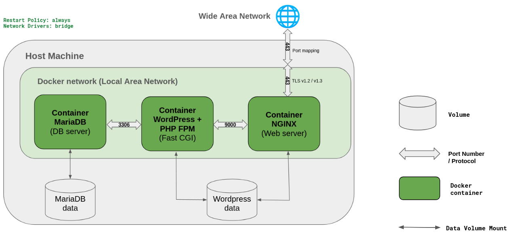

_This project has been created as part of the 42 curriculum by yanzhao._

# Inception

## Description
### Project Goals
The Inception project aims to create a microservice network including several services, each of which runs inside an isolated container.

### What are containers?
The containers are lightweight, portable packages that include everything needed to run an application.

### Why do we need containers?
It solves the "it works on my machine" problem by packaging the application with its environment into containers that run exactly the same way on every machine.

### Architecture
<p align="center">
  
</p>

### Key Features
- **Custom Docker Images**: A custom recipe to build containers tailored to specific development requirements.
- **Data Persistence**: Uses named volumes to save container data permanently on the host machine.
- **Network Isolation**: All containers communicate with one another within a private network using Bridge mode.
- **Sensitive Information Protection**: Uses Docker Secrets to securely manage credentials and prevent leaking sensitive data.

### Keywords comparaison
#### a. Virtual Machine VS Docker Container 
<table border="1" style="border-collapse: collapse; width: 100%;">
  <thead>
    <tr style="background-color: #2d2d2d; color: white;">
      <th style="border: 1px solid #555; padding: 10px; width: 50%;">Virtual Machines (VMs)</th>
      <th style="border: 1px solid #555; padding: 10px; width: 50%;">Docker Containers</th>
    </tr>
  </thead>
  <tbody>
    <tr>
      <td style="border: 1px solid #555; padding: 10px;">A complete, independent operating system sharing hardware resources with the host machine.</td>
      <td style="border: 1px solid #555; padding: 10px;">A special process sharing the kernel with the host machine that has its own file system and is completely isolated from other processes.</td>
    </tr>
  </tbody>
</table>

#### b. Secrets VS Environment Variables 
<table border="1" style="border-collapse: collapse; width: 100%;">
  <thead>
    <tr style="background-color: #2d2d2d; color: white;">
      <th style="border: 1px solid #555; padding: 10px; width: 50%;">Secrets</th>
      <th style="border: 1px solid #555; padding: 10px; width: 50%;">Environment Variables</th>
    </tr>
  </thead>
  <tbody>
    <tr>
      <td style="border: 1px solid #555; padding: 10px;">Store confidential data (e.g., database passwords, API keys, private keys).</td>
      <td style="border: 1px solid #555; padding: 10px;">Store non-confidential configuration data (e.g., domain names, database ports).</td>
    </tr>
    <tr>
      <td style="border: 1px solid #555; padding: 10px;">Mounted as temporary files at <code>/run/secrets/</code> inside the container.</td>
      <td style="border: 1px solid #555; padding: 10px;">Injected directly into the container's environment variables.</td>
    </tr>
    <tr>
      <td style="border: 1px solid #555; padding: 10px;">Data is stored in memory and removed when the container stops.</td>
      <td style="border: 1px solid #555; padding: 10px;">Can easily leak if someone checks container logs, runs <code>docker inspect</code>, or saves the container into an image.</td>
    </tr>
  </tbody>
</table>

#### c. Docker Network(Bridge) VS Host Network
<table border="1" style="border-collapse: collapse; width: 100%;">
  <thead>
    <tr style="background-color: #2d2d2d; color: white;">
      <th style="border: 1px solid #555; padding: 10px; width: 50%;">Docker Network (Bridge)</th>
      <th style="border: 1px solid #555; padding: 10px; width: 50%;">Host Network</th>
    </tr>
  </thead>
  <tbody>
    <tr>
      <td style="border: 1px solid #555; padding: 10px;">Containers run in an isolated virtual network with their own IP addresses. Port mapping is required to expose services to the host.</td>
      <td style="border: 1px solid #555; padding: 10px;">Containers share the host's network stack directly without isolation. They use the host's IP and ports directly, so no port mapping is needed.</td>
    </tr>
  </tbody>
</table>

#### d. Docker Volumes VS Bind Mounts
<table border="1" style="border-collapse: collapse; width: 100%;">
  <thead>
    <tr style="background-color: #2d2d2d; color: white;">
      <th style="border: 1px solid #555; padding: 10px; width: 50%;">Docker Volumes</th>
      <th style="border: 1px solid #555; padding: 10px; width: 50%;">Bind Mounts</th>
    </tr>
  </thead>
  <tbody>
    <tr>
      <td style="border: 1px solid #555; padding: 10px;">Automatically populates an empty volume with existing data from the container image.</td>
      <td style="border: 1px solid #555; padding: 10px;">If the host directory is empty, it overwrites and erases the container's directory on mount.</td>
    </tr>
    <tr>
      <td style="border: 1px solid #555; padding: 10px;">Managed by Docker.</td>
      <td style="border: 1px solid #555; padding: 10px;">Directly bound to a specific host directory defined by the user.</td>
    </tr>
    <tr>
      <td style="border: 1px solid #555; padding: 10px;">Can be listed and managed via Docker CLI (<code>docker volume ls</code>)</td>
      <td style="border: 1px solid #555; padding: 10px;">Independent of Docker CLI lifecycle management (can not be followed up by <code>docker volume</code>)</td> 
    </tr>
  </tbody>
</table>


## Instructions
### Compilation & Management
```bash
# Build Docker images for Nginx, WordPress, and MariaDB services and start running them in containers
make

# Stop and remove containers, networks, and Docker volumes created by compose
make clean

# Remove all containers, volumes, all unused Docker images, and clear host data directory
make fclean

# Rebuild the entire project from scratch
make re
```

## Resources
* [Learning the basics of Docker](https://www.devopssec.fr/category/apprendre-docker) - A comprehensive course to learn the basics of Docker.

* [Bind Mount vs Named Volume](https://www.geeksforgeeks.org/devops/docker-volume-vs-bind-mount/) - The comparaison between Bind Mount and Named Volume.

* [Roadmap of learning Docker](https://www.youtube.com/watch?v=zFa9_K8BS8I) - Learn Docker in 2026 - Complete Roadmap Beginner to Pro

### How do I use AI in our project?
I used AI as a learning companion to build a structured roadmap, enhancing both my theoretical knowledge and practical hands-on skills with Docker.
Through interactive discussions with AI, I was able to break down the project into logical steps, allowing me to build each container in a logical and systematic sequence. Furthermore, I deliberately tested incorrect configurations guided by AI to observe container reactions, which helped me understand the underlying setup choices and identify bad practices to avoid.